# leg-control

## 脚単体チェッカ(unit_leg_checker)

* モーター2軸を使って脚単体の動作を確認するためのチェッカ
  * リンク機構のデバッグを目的とする
  * そのうちモーター換える

## 4脚制御

* 1脚あたり2軸使って4脚を制御する
* raspi-configコマンドのインストール

```sh
wget -4 https://archive.raspberrypi.org/debian/pool/main/r/raspi-config/raspi-config_20210604_all.deb -P /tmp
sudo apt-get install libnewt0.52 whiptail parted triggerhappy lua5.1 alsa-utils -y
sudo apt-get install -fy
dpkg -i /tmp/raspi-config_20210604_all.deb
```

* I2C利用設定を有効化
* PCA9685はAdafruit社のライブラリを使用

```sh
pip install setuptools
git clone https://github.com/adafruit/Adafruit_Python_PCA9685.git
cd Adafruite_python_PCA9685
sudo python setup.py install
```

* PCA9685のアドレス確認

```sh
sudo apt-get install i2c-tools
sudo i2cdetect -y 1
```

* SG90の稼働域
  * 120step-361step-602step

* 脚稼働時のモーター稼働域
  * 30deg-150deg

### 前進・後退



**パラメータ**
* 脚先回転周波数f[Hz]
* 脚先端回転半径r[mm]
* 脚先端回転中心高さh[mm]
* 脚先端回転初期位相p[deg]


$$
\phi(t) = 2\pi ft + p \pi / 180 \\
x(t) = r \cos \phi(t) \\
y(t) = r \sin \phi(t) \\
$$
$$
L(t) = \sqrt{ (h - y(t))^2 + x(t)^2} \\
\theta(t) = acos( x(t) / L(t) ) \\
$$

## 参考

* [PICO-STDモーター仕様書](https://gwsus.com/gws_com_tw_www/english/product/servo/sat%20form.htm)
* [SG-90モーター仕様書]https://akizukidenshi.com/download/ds/towerpro/SG90_a.pdf)
* [raspi-configのインストール](https://askubuntu.com/questions/1130052/enable-i2c-on-raspberry-pi-ubuntu)
* [I2C利用設定の有効化](https://qiita.com/fujit33/items/763b09a6e71e65519740)
* [RaspiとPCA9685の接続](https://rb-station.com/blogs/article/pca9685-raspbery-pi-python)
* [SG-90モーターのデューティー比設定](https://toyo-interest.com/news/iot%e3%83%a9%e3%82%ba%e3%83%99%e3%83%aa%e3%83%bc%e3%83%91%e3%82%a4%e3%81%a7%e3%82%b5%e3%83%bc%e3%83%9c%e3%83%89%e3%83%a9%e3%82%a4%e3%83%90pca9685%e3%82%92%e4%bd%bf%e3%81%a3%e3%81%a6%e3%81%bf%e3%82%8b/)
* [Pythonで定周期で実行する方法と検証](https://qiita.com/montblanc18/items/05715730d99d450fd0d3)
* [Pythonで一定間隔で処理をさせる](https://birdhouse.hateblo.jp/entry/2021/04/27/102025#:~:text=signal.setitimer%20%28signal.ITIMER_REAL%2C%201%2C,0.1%29%20%E3%81%A7%E3%80%81%E3%81%93%E3%82%8C%E3%81%8C%E3%80%8C0.1%E7%A7%92%E5%BE%8C%E3%81%8B%E3%82%891%E7%A7%92%E9%96%93%E9%9A%94%E3%81%A7%E3%82%A4%E3%83%B3%E3%82%BF%E3%83%BC%E3%83%90%E3%83%AB%E3%82%BF%E3%82%A4%E3%83%9E%E3%83%BC%E3%82%92%E5%AE%9F%E8%A1%8C%E3%81%97%E3%81%A6%E3%81%8F%E3%82%8C%E3%80%8D%E3%81%A8%E3%81%84%E3%81%86%E6%84%8F%E5%91%B3%E3%80%82%20%E3%81%93%E3%81%AE%E3%82%A4%E3%83%B3%E3%82%BF%E3%83%BC%E3%83%90%E3%83%AB%E3%82%BF%E3%82%A4%E3%83%9E%E3%83%BC%E3%81%AF1%E7%A7%92%E3%81%94%E3%81%A8%E3%81%ABsignal.SIGALRM%E3%82%92%E9%80%81%E3%82%8A%E3%81%BE%E3%81%99%E3%80%82)

